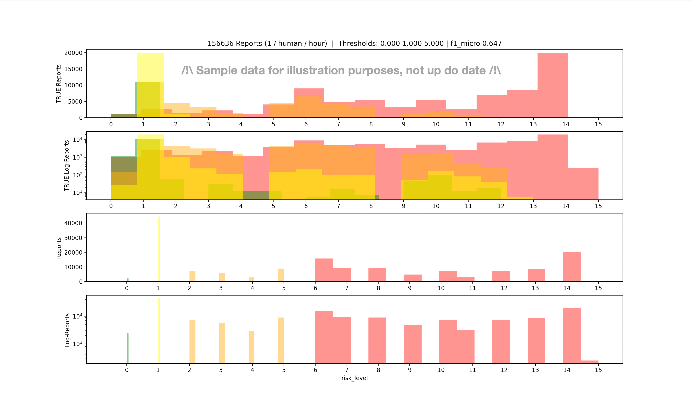

# Documentation for covid19sim/other/find_rec_level.py

## Finding the best recommendation levels

This script tries to find the optimal recommendation level mapping used in `covid19sim`.

The idea is: given some ground-truth, unobserved data which we can get from the simulator, what is the best way to map `risk` or `risk_level` to a `rec_level`, using thresholds.

Given that `risk` is continuous but we're only looking for 3 thresholds (for 4 recommendation levels) *and* they should be ordered, the search space isn't too large and a naïve random sampling strategy should be enough to find the best mapping.

On the other hand, `risk_level` is both discrete and small (in `[0 .. 15]`), we can therefore do a full grid-search (from `[0, 1, 2]` to `[13, 14, 15]`).

Doing one or the other depends on `--risk_level`.

## Best?

We need to define what we're optimizing for. The script currently supports 4 criteria: F1-scores (micro, macro, weighted [[?]](https://datascience.stackexchange.com/questions/15989/micro-average-vs-macro-average-performance-in-a-multiclass-classification-settin)]) and custom error rate. This is defined by the `--score` flag.

The error rate is saying: for each sample that I misclassified, what is the cost of this misclassification (`costs_for_category`), as a function of the true, underlying category (`get_category(...)`). If all values in `costs_for_category` are equal, the script will care equally for all misclassifications, but we might care more for some other.

`/!\` The `score` we choose is not an *objective function* in the sense that it's not optimized for in any other way than random or grid search over its 3 parameters (*i.e.* thresholds)

## Usage

Here's an extract of the script's comments & docstrings:

```
                                      HOW TO USE

    Data:
        This script expects pickled data that was output by ~ `python run.py ... tune=True`,
        meaning the city.tracker's data parsed by covid19sim.utils.extract_tracker_data

    Usage:

        $ python find_rec_levels.py --data path/to/data.pkl --risk_levels
        or
        $ python find_rec_levels.py --data path/to/data.pkl --samples 10000
        or
        $ python find_rec_levels.py --data path/to/data.pkl --risk_levels --plot_model "[1, 4, 8]"
        or
        $ python find_rec_levels.py --help

    File org:
        1. Constants used in exectution
        2. Available command-line arguments
        3. Parse & prepare data
        4. Sample thresholds (risks) or create list of all possible ones (risk_levels)
        5. Evaluate each sample
        6. Plot best model performance with 4 lines:
            a. For each ground-truth color (get_category & category_to_color)
               plot the risk/risk_level distribution
            b. Same, log-scale
            c. For each threshold color, plot the risk distribution
            d. Same, log-scale
```

## Plots

The output plots look like this (!this is just a sample on old, outdated data for the sake of the argument!):

* Top-2 plots: Color is ground truth (derived from values found in the `risk_attribute` which might be unobserved in the real world). Plot shows the distribution of `risk`/`risk_level` for each color. Second plot is a **log**-scale version of the first one.
* Bottom-2 plots: Color is inferred from the "model" *i.e.* the thresholds, and we plot each "predicted" color's distribution. Now because of the threshold scheme, distributions are non-overlapping - potentially unlike the ground-truth.

```
$ python find_rec_levels.py --risk_level --score f1_micro
```

